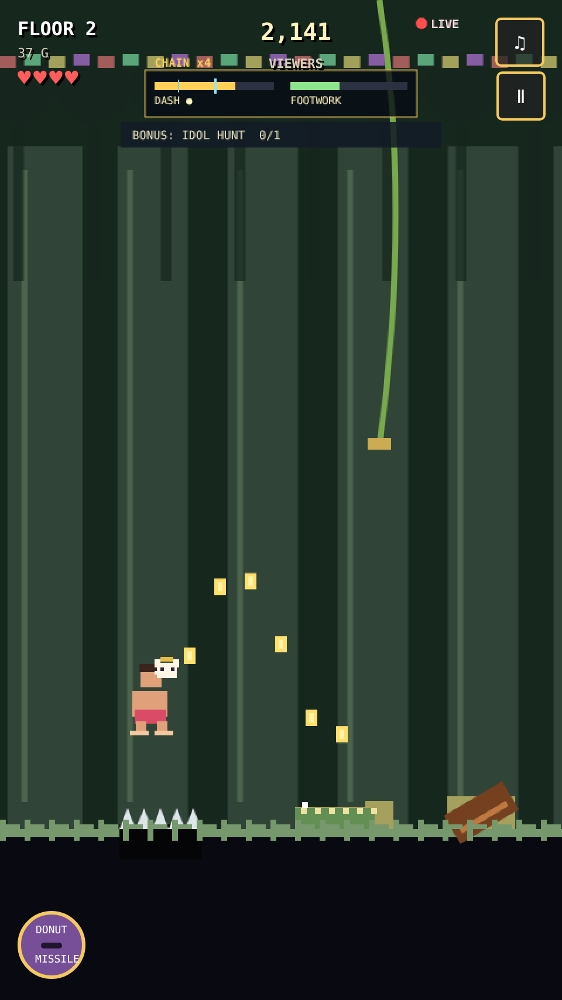

# 🍩 Carl's Doorway Dash

**A chaotic one-thumb endless runner where a barefoot game-show contestant sprints through a collapsing jungle dungeon.** No installs, no accounts, no dependencies — it's a single HTML file. Just tap to play.

### ▶️ [**Play it now →**](https://javamomma.github.io/Carls-Dash/)



---

## What is it?

You are Carl: a barefoot contestant on a live dungeon game show with terrible ratings insurance. Outrun rolling logs, croc pits, swinging blades, tunnels and vines across an ever-collapsing set of floors while the "viewers" counter climbs and a snarky announcer narrates your poor decisions. Bank the gold you grab into permanent perks between runs.

It's built to be **grabbed and played in ten seconds** on a phone — portrait, one thumb, instant restart.

## Features

- 🏃 **Deep one-thumb move set** — jump, slide, double-tap dive-kick (with a chaining ground-slam), swipe-up dash hop, and airborne vine grabs.
- ❤️ **Health bar** — trap hits cost hearts, not the whole run; clear a floor to heal.
- 🎯 **Bonus reels & hazard reels** — rotating objectives (stomp lines, vine runs, idol hunts) and timed setpieces (log stampede, crocodile causeway, vine gauntlet).
- 🔥 **Skill economy** — a DASH meter you *spend* (dash-hop, clutch dash-dodge) and a decaying near-miss combo that rewards playing dangerously.
- 📺 **Broadcast spectacle** — a reactive audience, FEET CAM cutaways, a LIVE bug, milestone coin showers, and an announcer with a full range of stingers.
- 💥 **Escape sprints** — each floor ends in a tap-to-outrun-the-collapse dash.
- 🛒 **Perk shop** — bank gold into 9 permanent upgrades (double/triple jump, tougher feet, a 5th heart, dash reserve, streak insurance, and more).
- 🎨 **100% procedural** — all pixel art is drawn on a canvas and all audio is synthesized in the browser. Zero external assets.

## Controls

| Input | Action |
|-------|--------|
| **Tap** | Jump (tap again in air for double/triple jump if unlocked) |
| **Swipe down** | Slide |
| **Double-tap in air** | Dive-kick → ground slam |
| **Swipe up** | Dash hop (spends DASH meter) |
| **Jump + hold near a vine** | Swing across |
| **Donut button** | Fire the DONUT MISSILE when the meter is full |
| **During a floor collapse** | Tap rapidly to outrun the wall |

Keyboard also works: **Space** = jump, **↓** = slide/dive, **D** = missile.

## Run locally

It's a static file — no build step, no server required.

```bash
git clone https://github.com/Javamomma/Carls-Dash.git
cd Carls-Dash
# just open index.html in a browser, or serve it:
python3 -m http.server 8000   # then visit http://localhost:8000
```

## Tech notes

- Single self-contained `index.html` (~50 KB) — HTML5 `<canvas>`, vanilla JS, no libraries.
- Procedural sprite factory + fully synthesized Web Audio (no image or sound files).
- Fixed-timestep game loop with object pooling for obstacles, coins, loot, and particles.
- Progress (best score, gold, perks, mute) persists in `localStorage`.
- Deployed free via GitHub Pages.

## License

Released under the [MIT License](LICENSE) — free to play, fork, and build on.
