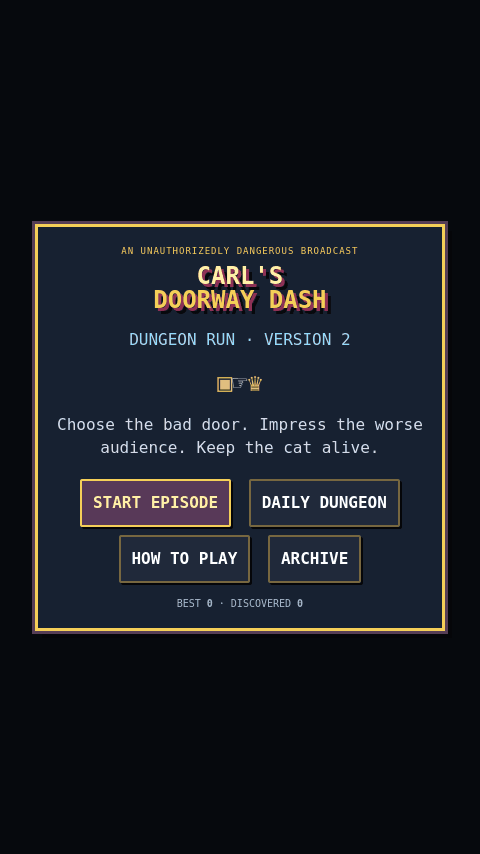

# Carl's Doorway Dash: Dungeon Run

**Version 2.1 turns the original one-thumb runner into a compact pixel arcade roguelite with authored set-pieces.** Swing from vines, grind rails, bounce to high routes, hijack minecarts, clear visible room objectives, work with Donut, and fight your way down an increasingly unreasonable dungeon.

Play the published build at **https://javamomma.github.io/Carls-Dash/**.



## Version 2.1 highlights

- **Real route choices** — choose between supply tunnels, mob dens, stunt routes, sponsor vaults, mystery doors, and crawler rescues.
- **Achievements and loot boxes** — fourteen discoverable achievements award Bronze, Silver, or Gold boxes.
- **Safe rooms and run builds** — open boxes, choose strange equipment, heal at a cost, and manage a three-slot inventory.
- **Carl and Donut teamwork** — Donut can Zap, Charm, or Scout. Tap her button to act; hold it to switch abilities.
- **Improvised interactions** — grease an enemy into another hazard, deploy traps, reverse obstacles, light dark rooms, or bomb a boss.
- **Authored traversal rooms** — fifteen named set-pieces replace random obstacle repetition with swing vines, grind rails, spore pads, minecarts, high routes, signal motes, and mob runs.
- **Visible objectives and ratings tiers** — every room reports exact progress, every third completed objective awards a Silver Box, and each measurable audience milestone awards a stated Bronze, Silver, or Gold Box.
- **Five distinct boss rules** — ram and stall the Goblin Dozer, cool the Furnace Foreman, reveal the Tunnel Queen, switch the Ticket Tyrant's tracks, and punish the Celebrity Hunter's reload.
- **Stairwell deadlines** — descend safely or steal one last box and pay for the delay with health.
- **Crawler classes** — Floor 3 offers Brawler, Junk Engineer, and Crowd Problem builds.
- **Readable sponsor contracts** — exactly one offer arrives per floor, with guaranteed immediate effects, room duration, benefit, and penalty pinned in the HUD.
- **Daily Dungeon** — deterministic daily routes use a separate random stream from visual effects.
- **Classic presentation** — low-resolution canvas art, hard pixels, limited floor palettes, synthesized sound, and no external runtime dependencies.

## Controls

| Input | Action |
|---|---|
| Tap / Space | Jump; tap again for an air jump |
| Swipe down / Down Arrow | Slide on the ground or dive-stomp in the air |
| Swipe up / Up Arrow | Clutch dash |
| Donut button / D | Use Donut's ability; hold the button to switch ability |
| Item buttons / 1–3 | Use an equipped item |
| Door buttons / Left–Right Arrows | Choose the next room |
| Swing vine | Jump into its handle; tap again to launch early |
| Grind rail | Land on it; jump to pop off |
| Spore pad | Run onto it for an automatic high bounce |
| Minecart | Collect it, jump normally, and smash light hazards |

## Development

The editable source is split into a template, stylesheet, and game script. A dependency-free Node build combines them into the single `index.html` used by GitHub Pages.

```bash
npm run build
npm test
python3 -m http.server 8000
```

Project layout:

```text
src/index.template.html  Page structure and UI
src/styles.css           Pixel cabinet and responsive interface
src/game.js              Data-driven game systems and rendering
scripts/build.mjs        Single-file release builder
test/                    Static and headless state-flow checks
index.html               Generated GitHub Pages build
```

`index.html` is committed intentionally so GitHub Pages can serve the game without a build service.

## Version history

- `v1.0.0` preserves the original endless-runner release.
- `v2.0.0` preserves the first room-based arcade roguelite release.
- `version-2.1` contains the authored-room and unique-boss overhaul.

## Fan-project notice

This is an unofficial, non-commercial fan project. *Dungeon Crawler Carl* and its characters belong to their respective creator and rights holders. The MIT license applies to this repository's original code; it does not grant rights to third-party names, characters, or settings.

## License

Original code is released under the [MIT License](LICENSE).
